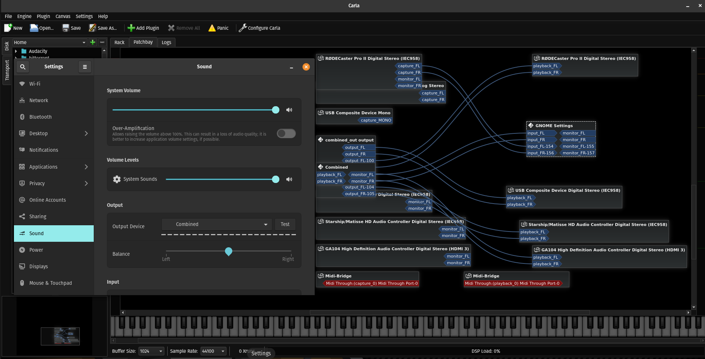
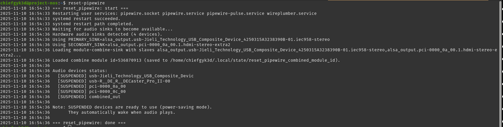
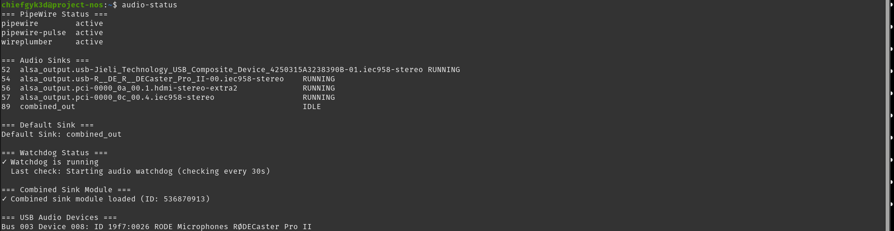
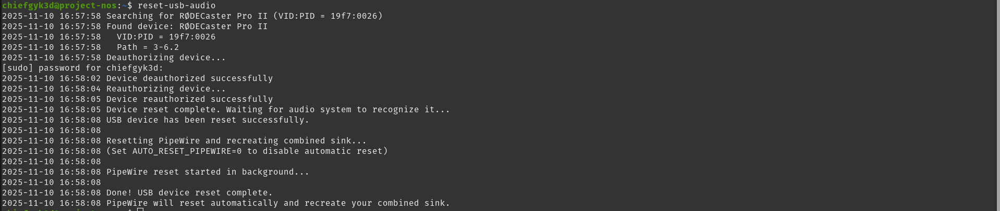

# PipeWire Combined Audio Output Reset Script

<div align="center">
  
</div>

A robust shell script to restart PipeWire and create a combined audio sink that outputs to multiple devices simultaneously. Ideal for streaming, recording, or monitoring audio across multiple outputs (e.g., speakers + HDMI capture card, headphones + virtual device).

## Use Case

If you use PipeWire and need audio to play through multiple outputs at once—for example:
- **Streaming/Recording**: Send audio to your speakers/headphones AND an HDMI capture card for OBS
- **Multi-room audio**: Play the same audio on multiple speakers or zones
- **Monitoring**: Listen on headphones while recording to a USB audio interface

This script safely restarts PipeWire services and sets up a combined sink that mirrors audio to two devices.

### 2PC Streaming Setup

This script is particularly useful for **2PC streaming setups** where you're running Linux as your primary machine and a separate box as your stream machine. While you don't need this setup to stream, it's incredibly helpful if you want to:

- **Hear your main machine's audio** on your local speakers/headphones
- **Send the same audio to your streaming PC** via HDMI capture card or network audio
- **Keep your stream machine's audio configuration simple** without complex routing

This is how I've been reliably running my 2PC stream setup with Linux as the primary gaming/production machine. The combined sink lets me monitor everything I'm doing while the stream PC captures a clean audio feed.

<div align="center">
  
  <p><em>Combined audio output routing to multiple devices simultaneously</em></p>
</div>

## Problem Solved

When using `module-combine-sink` in PipeWire, audio devices can sometimes disappear from system settings after a day or two, especially after:
- Suspend/resume cycles
- USB device reconnections
- PipeWire session manager crashes

This typically requires a full system reboot. **This script provides a reboot-free fix** by:
1. Safely restarting PipeWire services (or killing/cleaning stale sockets if systemd fails)
2. Detecting and verifying your audio sinks
3. Creating a fresh combined sink with proper slave configuration
4. Setting it as the default output

## Features

- ✅ **Safe restart**: Uses systemd when available, falls back to process kill + socket cleanup
- ✅ **Auto-detection**: Automatically finds USB and HDMI/PCI audio devices
- ✅ **Idempotent**: Unloads previous combined modules before creating new ones
- ✅ **Configurable**: Set exact sink names or let the script detect them
- ✅ **Timestamped logging**: Easy troubleshooting with clear log output
- ✅ **Non-destructive**: Preserves user config, only cleans runtime state
- ✅ **Watchdog service**: Optional automatic monitoring and recovery with enhanced health checks
- ✅ **USB device reset**: Handle stuck USB audio devices without physical replug
- ✅ **State cleanup**: Clear corrupted Wireplumber state files
- ✅ **Status checker**: Quick audio-status command for system overview
- ✅ **Nuclear option**: Aggressive fallback with kernel module reload for severe failures
- ✅ **Sample rate management**: Auto-detects and fixes sample rate mismatches to prevent pitch shifting

## Requirements

- **PipeWire** (with `pipewire-pulse` for PulseAudio compatibility)
- **wireplumber** or **pipewire-media-session** (session manager)
- **pactl** (usually part of `pipewire-pulse` or `pulseaudio-utils`)
- **systemd** (for user services; fallback available if not present)

## Installation

```bash
# Clone or download the script
git clone https://github.com/ChiefGyk3D/pipewire_sink.git
cd pipewire_sink

# Make it executable
chmod +x reset_pipewire.sh

# Install helper scripts to your local bin
mkdir -p ~/.local/bin
cp reset_pipewire.sh ~/.local/bin/reset-pipewire
cp examples/audio-status.sh ~/.local/bin/audio-status
cp examples/reset-usb-audio.sh ~/.local/bin/reset-usb-audio
cp examples/pipewire-watchdog.sh ~/.local/bin/pipewire-watchdog
chmod +x ~/.local/bin/reset-pipewire ~/.local/bin/audio-status ~/.local/bin/reset-usb-audio ~/.local/bin/pipewire-watchdog

# (Optional) Install sample rate config to prevent pitch shifting
# Note: reset-pipewire will auto-create this if it detects mismatched rates
mkdir -p ~/.config/pipewire/pipewire.conf.d/
cp examples/99-custom-rate.conf ~/.config/pipewire/pipewire.conf.d/
```

## Usage

### Quick Start (Auto-detection)

```bash
./reset_pipewire.sh
```

<div align="center">
  
</div>

The script will:
1. Restart PipeWire services
2. Auto-detect your primary and secondary audio sinks
3. Create a combined sink and set it as default

### Configuration (Recommended)

For reliable operation, specify your exact sink names by editing the script:

1. **Find your sink names:**
   ```bash
   pactl list short sinks
   ```
   
   Example output:
   ```
   52  alsa_output.usb-Device_Name.analog-stereo    PipeWire  s24le 2ch 48000Hz  RUNNING
   54  alsa_output.pci-0000_00_1f.3.hdmi-stereo     PipeWire  s32le 2ch 48000Hz  SUSPENDED
   ```

2. **Edit the script** and set your sink names:
   ```bash
   PRIMARY_SINK="alsa_output.usb-Device_Name.analog-stereo"
   SECONDARY_SINK="alsa_output.pci-0000_00_1f.3.hdmi-stereo"
   ```

3. **Optional**: Customize the combined sink name and description:
   ```bash
   COMBINED_SINK_NAME="my_combined"
   COMBINED_SINK_DESCRIPTION="Speakers + HDMI"
   ```

4. **Run the script:**
   ```bash
   ./reset_pipewire.sh
   ```

### Environment Variables (Alternative)

You can also pass configuration via environment variables without editing the script:

```bash
PRIMARY_SINK="alsa_output.usb-..." \
SECONDARY_SINK="alsa_output.pci-..." \
./reset_pipewire.sh
```

### Advanced Options

**Clean WirePlumber State** - Use if devices won't appear:
```bash
CLEAN_STATE=1 ./reset_pipewire.sh
```

**Reset USB Audio Devices** - For devices that are "stuck" (shows audio but no sound):
```bash
RESET_USB=1 ./reset_pipewire.sh
```
*Note: Requires `usbreset` utility. Install on Ubuntu/Debian: `sudo apt install usbutils`*

## Verification

After running the script, verify it worked:

```bash
# Quick status check (recommended)
audio-status

# Or check manually:
# Check if PipeWire is running
systemctl --user status pipewire.service

# List sinks (look for your combined sink)
pactl list short sinks

# Check default sink
pactl info | grep "Default Sink"

# Test audio playback
paplay /usr/share/sounds/alsa/Front_Center.wav
```

You should see audio playing simultaneously on both outputs.

### Understanding Audio Device States

PipeWire shows different states for audio devices:

- **SUSPENDED** - Device is ready but powered down (normal when idle). Automatically wakes when audio plays.
- **IDLE** - Device is awake and ready, but not currently playing audio
- **RUNNING** - Currently playing audio
- **ERROR** - Device has an error and needs attention

**SUSPENDED is normal!** It's PipeWire's power-saving feature. Devices in SUSPENDED state will instantly wake up when audio plays. If you see SUSPENDED, your audio is working correctly.

### After Running the Script

The script automatically attempts to reconnect audio applications by:
- Moving all active audio streams to the new default sink
- Signaling Firefox to reconnect its audio
- Detecting Chrome/Chromium (which usually auto-reconnect)

**However**, some applications may still need to be restarted if audio doesn't return:
- Web browsers (Chrome, Firefox) - try reloading the tab first
- Media players (VLC, MPV) - pause and resume may work
- Communication apps (Discord, Zoom, Teams)
- Games - usually require full restart

**Pro Tip**: Enable the watchdog service to catch and fix audio issues *before* they break, minimizing the need for app restarts.

## Helper Tools

After installation, you'll have access to these helper scripts:

### `audio-status` - Quick System Status
Shows a comprehensive overview of your audio system:
```bash
audio-status
```

<div align="center">
  
</div>

Displays:
- PipeWire service status (pipewire, pipewire-pulse, wireplumber)
- All audio sinks with their current state
- Default sink configuration
- Watchdog service status
- Combined sink module information
- Connected USB audio devices

### `reset-pipewire` - Main Reset Script
Restarts PipeWire and recreates the combined sink:
```bash
reset-pipewire                    # Normal reset
CLEAN_STATE=1 reset-pipewire      # Clean WirePlumber state files
RESET_USB=1 reset-pipewire        # Also reset USB audio devices
```

### `reset-usb-audio` - USB Device Reset
For when USB audio devices are stuck (shows activity but no sound):
```bash
sudo reset-usb-audio                    # Auto-detects RØDECaster Pro II
sudo reset-usb-audio "Scarlett"         # Reset by device name
sudo reset-usb-audio 19f7:0026          # Reset by VID:PID
AUTO_RESET_PIPEWIRE=0 sudo reset-usb-audio  # Skip automatic PipeWire reset
```

<div align="center">
  
</div>

### `reset-pipewire-nuclear` - Nuclear Option (For Severe Failures)
When normal reset doesn't work and you'd otherwise need to reboot:
```bash
reset-pipewire-nuclear          # Aggressive cleanup without kernel reload
sudo reset-pipewire-nuclear     # Full nuclear - includes kernel module reload
```

Use this when:
- Normal `reset-pipewire` fails completely
- You see "can't open control for card hw:X" errors in logs
- Audio system is completely unresponsive
- Hardware-level issues that survive normal restarts

This performs force-kill of all audio processes, removes all state/runtime files, and optionally reloads kernel modules. See Troubleshooting section for details.

### `reset-usb-audio` - USB Device Reset (Continued)

This script:
- Deauthorizes/reauthorizes the USB device (simulating unplug/replug)
- Automatically resets PipeWire and recreates combined sink (can be disabled)
- Works with any USB audio device (RØDECaster, Scarlett, Behringer, etc.)
- No physical unplugging needed!

## Troubleshooting

### Audio devices not detected

**Problem**: Script reports "No sinks detected" or can't find your devices.

**Solutions**:
- Ensure devices are powered on and connected
- Check with `pactl list short sinks` to see available sinks
- Manually set `PRIMARY_SINK` and `SECONDARY_SINK` in the script
- Check PipeWire logs: `journalctl --user -u pipewire -u wireplumber --since "5 min ago"`

### Combined sink not working

**Problem**: Combined sink created but audio only plays on one device.

**Solutions**:
- Verify both slave sinks are not muted: `pactl list sinks | grep -A10 "Name: your_sink_name"`
- Try different `resample_method` values: `soxr-vhq`, `speex-float-10`, or `ffmpeg`
- Increase `adjust_time` parameter (currently 10, try 15 or 20)

### Script fails with "systemd restart failed"

**Problem**: systemd can't restart services, but the script continues with fallback.

**Solutions**:
- This is usually fine—the fallback method will clean up and restart
- Check if PipeWire user services are enabled: `systemctl --user status pipewire pipewire-pulse wireplumber`
- If services are masked or disabled, enable them: `systemctl --user enable --now pipewire pipewire-pulse wireplumber`

### Audio devices still disappear after using the script

**Problem**: Script works temporarily but devices disappear again after hours/days.

**Solutions**:
- **Use the watchdog service** (see below) to automatically detect and fix issues
- Run with `CLEAN_STATE=1 reset-pipewire` to force clean WirePlumber state files
- Check for USB power management issues: `lsusb -t` to see if devices are suspending
- Disable USB autosuspend for audio devices: Add to `/etc/udev/rules.d/50-usb-audio-powersave.rules`:
  ```
  ACTION=="add", SUBSYSTEM=="usb", ATTR{idVendor}=="XXXX", ATTR{idProduct}=="YYYY", TEST=="power/control", ATTR{power/control}="on"
  ```
  (Replace XXXX and YYYY with your device IDs from `lsusb`)

### Audio still broken after running script

**Problem**: Script runs but audio devices still don't appear in settings, or you see errors like "can't open control for card hw:0" in logs.

**Solutions**:
1. **Try the nuclear reset option first** (see below)
2. Check PipeWire config for errors: `~/.config/pipewire/`
3. Verify kernel modules: `lsmod | grep snd`
4. Test if ALSA sees devices: `aplay -l`
5. As a last resort, reboot and then use this script going forward

### Nuclear reset option (for severe failures)

**Problem**: Normal `reset-pipewire` doesn't work, devices still missing, or you see hardware errors like "can't open control for card hw:X" in journal logs.

**When to use**: This is the aggressive fallback for cases where:
- Normal reset-pipewire fails completely
- Hardware card errors appear in logs
- Audio system is completely unresponsive
- You would otherwise need to reboot

**Solution**: Use the nuclear reset script:
```bash
reset-pipewire-nuclear
```

This performs a complete teardown and rebuild:
1. Force-kills all audio processes (pipewire, wireplumber, pulseaudio)
2. Removes all runtime sockets and state files
3. Optionally reloads kernel audio modules (with `sudo`)
4. Waits for clean restart and verifies connectivity

**With kernel module reload** (more thorough, requires sudo):
```bash
sudo reset-pipewire-nuclear
```

This additionally reloads the ALSA kernel modules (`snd_hda_intel`, etc.), which can fix hardware-level issues that survive normal restarts.

**After nuclear reset**: The watchdog will detect that audio is back and recreate your combined sink automatically within 30 seconds. Or manually run `reset-pipewire` if you want it immediately.

### Want to remove the combined sink

```bash
# Find the module ID
pactl list short modules | grep combine

# Unload it (replace 12345 with actual ID)
pactl unload-module 12345

# Or delete the saved module ID file and re-run the script
rm ~/.local/state/reset_pipewire_combined_module_id
```

### RØDECaster/USB device shows audio but no sound

**Problem**: Device is connected, shows audio levels/activity, but no sound comes out until you unplug/replug it.

**Solution**: Use the dedicated reset script (one command!):
```bash
sudo reset-usb-audio
```

The script will:
1. Find and reset your USB audio device
2. Automatically reset PipeWire
3. Recreate your combined sink

**Works with any USB audio device**:
```bash
sudo reset-usb-audio                     # Auto-detects RØDECaster Pro II
sudo reset-usb-audio "Scarlett 2i2"      # Find by device name  
sudo reset-usb-audio 19f7:0026           # Specify VID:PID directly
```

**Disable automatic PipeWire reset**:
```bash
AUTO_RESET_PIPEWIRE=0 sudo reset-usb-audio
```

**Alternative**: Use the `RESET_USB=1` option with the main script to reset all USB audio devices at once:
```bash
RESET_USB=1 reset-pipewire
```

### Audio pitch is wrong / sounds sped up or slowed down

**Problem**: Audio through HDMI capture card sounds higher or lower pitch than normal.

**Cause**: Sample rate mismatch. Your devices are running at different sample rates (e.g., 44.1kHz vs 48kHz), causing pitch shifting when audio is resampled incorrectly.

**Automatic Fix**: The `reset-pipewire` script automatically detects sample rate mismatches and creates the fix. Just run:
```bash
reset-pipewire
```
The script will detect the mismatch, create the config file, and notify you. After the next PipeWire restart, all devices will use 48kHz.

**Manual Solution** (if needed): Force all devices to use 48kHz (professional standard):

1. Create a PipeWire config file:
```bash
mkdir -p ~/.config/pipewire/pipewire.conf.d/
cat > ~/.config/pipewire/pipewire.conf.d/99-custom-rate.conf << 'EOF'
# Force 48kHz sample rate for all devices to prevent pitch shifting
context.properties = {
    default.clock.rate = 48000
    default.clock.allowed-rates = [ 48000 ]
}
EOF
```

2. Restart PipeWire:
```bash
systemctl --user restart pipewire.service pipewire-pulse.service wireplumber.service
```

3. Recreate your combined sink:
```bash
reset-pipewire
```

All devices will now run at 48kHz, preventing pitch shifting. You can verify with:
```bash
pactl list short sinks  # Should show 48000Hz for all devices
```

### After USB audio device firmware update

**Problem**: After updating firmware on USB audio devices (RØDECaster, Scarlett, etc.), audio stops working, mixer can't detect device, or routing is broken.

**Cause**: Firmware updates often change:
- USB audio descriptors and how the device identifies itself
- Available audio profiles, sample rates, and bit depths
- Default output routing and channel mapping
- Power management and suspend/resume behavior

Linux/PipeWire caches device information, so after a major firmware update (e.g., RØDECaster Pro II 1.3.4 → 1.6.8), the cached info doesn't match the device's new behavior.

**Solution**: Force complete USB device reset and PipeWire restart:
```bash
RESET_USB=1 reset-pipewire
```

This will:
1. Physically reset the USB audio device (reauthorize via sysfs)
2. Restart PipeWire services
3. Toggle device card profiles to force re-enumeration
4. Recreate combined sink with correct settings

**If that doesn't work**, use the nuclear option:
```bash
sudo reset-pipewire-nuclear
```

**Best Practice**: After any USB audio device firmware update, always run `RESET_USB=1 reset-pipewire` to ensure clean re-detection.

## Advanced Configuration

### Custom module parameters

Edit the `pactl load-module` line in the `load_combined()` function to add parameters:

```bash
pactl load-module module-combine-sink \
  sink_name="${COMBINED_SINK_NAME}" \
  sink_properties=device.description="${COMBINED_SINK_DESCRIPTION}" \
  slaves="${PRIMARY_SINK},${SECONDARY_SINK}" \
  adjust_time=10 \
  resample_method=copy \
  channels=2 \
  rate=48000
```

See `man pactl` and PipeWire documentation for more options.

### Run automatically on login

An example systemd user unit file is provided in this repository at
`examples/pipewire-combined.service`. To enable the example on your machine:

```bash
# copy the example to your user systemd folder
mkdir -p ~/.config/systemd/user/
cp examples/pipewire-combined.service ~/.config/systemd/user/pipewire-combined.service

# reload user systemd units, enable and start the one-shot service
systemctl --user daemon-reload
systemctl --user enable --now pipewire-combined.service
```

By default the example uses `ExecStart=%h/.local/bin/reset-pipewire` (expands to
your home directory). If you installed the script elsewhere, update the
`ExecStart` path in the copied unit file accordingly.

### Automatic monitoring with watchdog service (Recommended)

If your audio devices disappear periodically, you can set up an automatic watchdog that monitors your audio devices and runs the reset script when needed:

```bash
# Copy the watchdog script and service
cp ~/src/pipewire/examples/pipewire-watchdog.sh ~/.local/bin/pipewire-watchdog
chmod +x ~/.local/bin/pipewire-watchdog
cp ~/src/pipewire/examples/pipewire-watchdog.service ~/.config/systemd/user/

# Enable and start the watchdog
systemctl --user daemon-reload
systemctl --user enable --now pipewire-watchdog.service

# Check status
systemctl --user status pipewire-watchdog.service

# View watchdog logs
journalctl --user -u pipewire-watchdog -f
```

The watchdog:
- Checks audio device health every 30 seconds
- Triggers reset after 3 consecutive failures (90 seconds of issues)
- Automatically restarts if it crashes
- Logs all actions to systemd journal

<div align="center">
  
</div>

## How It Works

1. **Restart Phase**: 
   - Tries to restart PipeWire services via systemd
   - If systemd fails, kills processes and removes stale runtime sockets from `$XDG_RUNTIME_DIR`
   - Optionally cleans WirePlumber state files if `CLEAN_STATE=1` is set or if corruption is detected
   - Waits for services to come back up

2. **Detection Phase**:
   - Waits up to 20 seconds for hardware audio devices to appear
   - Lists available sinks via `pactl`, excluding dummy/null devices
   - Auto-detects primary (USB preferred) and secondary (HDMI/PCI preferred) sinks
   - Uses user-configured sink names if provided
   - Verifies at least 2 hardware sinks are available before proceeding

3. **Module Phase**:
   - Unloads any previously saved combined module
   - Loads `module-combine-sink` with specified slaves
   - Saves the new module ID for future unloading
   - Sets the combined sink as default

## Contributing

Contributions welcome! Please:
- Test changes on your system first
- Update the README if you add features
- Keep the script POSIX-compatible where possible
- Add clear comments for complex logic

## License

Mozilla Public License 2.0 (MPL-2.0) - feel free to use, modify, and distribute. See [LICENSE](LICENSE) for full terms.

## 💝 Donations and Tips

If you find Stream Daemon useful, consider supporting development:

**Donate**:

<div align="center">
  <table>
    <tr>
      <td align="center"><a href="https://patreon.com/chiefgyk3d?utm_medium=unknown&utm_source=join_link&utm_campaign=creatorshare_creator&utm_content=copyLink" title="Patreon"></a></td>
      <td align="center"><a href="https://streamelements.com/chiefgyk3d/tip" title="StreamElements"></a></td>
    </tr>
    <tr>
      <td align="center">Patreon</td>
      <td align="center">StreamElements</td>
    </tr>
  </table>
</div>

### Cryptocurrency Tips

<div align="center">
  <table style="border:none;">
    <tr>
      <td align="center" style="padding:8px; min-width:120px;">
        
      </td>
      <td align="left" style="padding:8px;">
        <b>Bitcoin</b><br/>
        <code style="font-size:12px;">bc1qztdzcy2wyavj2tsuandu4p0tcklzttvdnzalla</code>
      </td>
    </tr>
    <tr>
      <td align="center" style="padding:8px; min-width:120px;">
        
      </td>
      <td align="left" style="padding:8px;">
        <b>Monero</b><br/>
        <code style="font-size:12px;">84Y34QubRwQYK2HNviezeH9r6aRcPvgWmKtDkN3EwiuVbp6sNLhm9ffRgs6BA9X1n9jY7wEN16ZEpiEngZbecXseUrW8SeQ</code>
      </td>
    </tr>
    <tr>
      <td align="center" style="padding:8px; min-width:120px;">
        
      </td>
      <td align="left" style="padding:8px;">
        <b>Ethereum</b><br/>
        <code style="font-size:12px;">0x554f18cfB684889c3A60219BDBE7b050C39335ED</code>
      </td>
    </tr>
  </table>
</div>

---

<div align="center">

Made with ❤️ by [ChiefGyk3D](https://github.com/ChiefGyk3D)

## Author & Socials

<table>
  <tr>
    <td align="center"><a href="https://social.chiefgyk3d.com/@chiefgyk3d" title="Mastodon"></a></td>
    <td align="center"><a href="https://bsky.app/profile/chiefgyk3d.com" title="Bluesky"></a></td>
    <td align="center"><a href="http://twitch.tv/chiefgyk3d" title="Twitch"></a></td>
    <td align="center"><a href="https://www.youtube.com/channel/UCvFY4KyqVBuYd7JAl3NRyiQ" title="YouTube"></a></td>
    <td align="center"><a href="https://kick.com/chiefgyk3d" title="Kick"></a></td>
    <td align="center"><a href="https://www.tiktok.com/@chiefgyk3d" title="TikTok"></a></td>
    <td align="center"><a href="https://discord.chiefgyk3d.com" title="Discord"></a></td>
    <td align="center"><a href="https://matrix-invite.chiefgyk3d.com" title="Matrix"></a></td>
  </tr>
  <tr>
    <td align="center">Mastodon</td>
    <td align="center">Bluesky</td>
    <td align="center">Twitch</td>
    <td align="center">YouTube</td>
    <td align="center">Kick</td>
    <td align="center">TikTok</td>
    <td align="center">Discord</td>
    <td align="center">Matrix</td>
  </tr>
</table>

## Related Resources

- [PipeWire Wiki](https://gitlab.freedesktop.org/pipewire/pipewire/-/wikis/home)
- [PipeWire Config Guide](https://gitlab.freedesktop.org/pipewire/pipewire/-/wikis/Config-PipeWire)
- [Module Combine Sink Docs](https://www.freedesktop.org/wiki/Software/PulseAudio/Documentation/User/Modules/#module-combine-sink)
