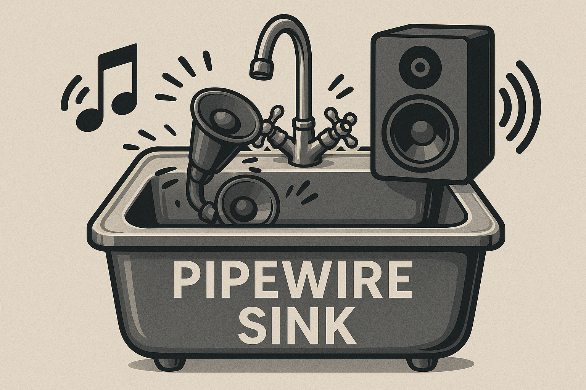

# PipeWire Combined Audio Output Reset Script

<div align="center">
  
</div>

A robust shell script to restart PipeWire and create a combined audio sink that outputs to multiple devices simultaneously. Ideal for streaming, recording, or monitoring audio across multiple outputs (e.g., speakers + HDMI capture card, headphones + virtual device).

## Use Case

If you use PipeWire and need audio to play through multiple outputs at once—for example:
- **Streaming/Recording**: Send audio to your speakers/headphones AND an HDMI capture card for OBS
- **Multi-room audio**: Play the same audio on multiple speakers or zones
- **Monitoring**: Listen on headphones while recording to a USB audio interface

This script safely restarts PipeWire services and sets up a combined sink that mirrors audio to two devices.

### 2PC Streaming Setup

This script is particularly useful for **2PC streaming setups** where you're running Linux as your primary machine and a separate box as your stream machine. While you don't need this setup to stream, it's incredibly helpful if you want to:

- **Hear your main machine's audio** on your local speakers/headphones
- **Send the same audio to your streaming PC** via HDMI capture card or network audio
- **Keep your stream machine's audio configuration simple** without complex routing

This is how I've been reliably running my 2PC stream setup with Linux as the primary gaming/production machine. The combined sink lets me monitor everything I'm doing while the stream PC captures a clean audio feed.

## Problem Solved

When using `module-combine-sink` in PipeWire, audio devices can sometimes disappear from system settings after a day or two, especially after:
- Suspend/resume cycles
- USB device reconnections
- PipeWire session manager crashes

This typically requires a full system reboot. **This script provides a reboot-free fix** by:
1. Safely restarting PipeWire services (or killing/cleaning stale sockets if systemd fails)
2. Detecting and verifying your audio sinks
3. Creating a fresh combined sink with proper slave configuration
4. Setting it as the default output

## Features

- ✅ **Safe restart**: Uses systemd when available, falls back to process kill + socket cleanup
- ✅ **Auto-detection**: Automatically finds USB and HDMI/PCI audio devices
- ✅ **Idempotent**: Unloads previous combined modules before creating new ones
- ✅ **Configurable**: Set exact sink names or let the script detect them
- ✅ **Timestamped logging**: Easy troubleshooting with clear log output
- ✅ **Non-destructive**: Preserves user config, only cleans runtime state
- ✅ **Watchdog service**: Optional automatic monitoring and recovery
- ✅ **USB device reset**: Handle stuck USB audio devices without physical replug
- ✅ **State cleanup**: Clear corrupted WirePlumber state files
- ✅ **Status checker**: Quick audio-status command for system overview

## Requirements

- **PipeWire** (with `pipewire-pulse` for PulseAudio compatibility)
- **wireplumber** or **pipewire-media-session** (session manager)
- **pactl** (usually part of `pipewire-pulse` or `pulseaudio-utils`)
- **systemd** (for user services; fallback available if not present)

## Installation

```bash
# Clone or download the script
git clone https://github.com/ChiefGyk3D/pipewire_sink.git
cd pipewire_sink

# Make it executable
chmod +x reset_pipewire.sh

# Install helper scripts to your local bin
mkdir -p ~/.local/bin
cp reset_pipewire.sh ~/.local/bin/reset-pipewire
cp examples/audio-status.sh ~/.local/bin/audio-status
cp examples/reset-rodecaster.sh ~/.local/bin/reset-rodecaster
cp examples/pipewire-watchdog.sh ~/.local/bin/pipewire-watchdog
chmod +x ~/.local/bin/reset-pipewire ~/.local/bin/audio-status ~/.local/bin/reset-rodecaster ~/.local/bin/pipewire-watchdog
```

## Usage

### Quick Start (Auto-detection)

```bash
./reset_pipewire.sh
```

The script will:
1. Restart PipeWire services
2. Auto-detect your primary and secondary audio sinks
3. Create a combined sink and set it as default

### Configuration (Recommended)

For reliable operation, specify your exact sink names by editing the script:

1. **Find your sink names:**
   ```bash
   pactl list short sinks
   ```
   
   Example output:
   ```
   52  alsa_output.usb-Device_Name.analog-stereo    PipeWire  s24le 2ch 48000Hz  RUNNING
   54  alsa_output.pci-0000_00_1f.3.hdmi-stereo     PipeWire  s32le 2ch 48000Hz  SUSPENDED
   ```

2. **Edit the script** and set your sink names:
   ```bash
   PRIMARY_SINK="alsa_output.usb-Device_Name.analog-stereo"
   SECONDARY_SINK="alsa_output.pci-0000_00_1f.3.hdmi-stereo"
   ```

3. **Optional**: Customize the combined sink name and description:
   ```bash
   COMBINED_SINK_NAME="my_combined"
   COMBINED_SINK_DESCRIPTION="Speakers + HDMI"
   ```

4. **Run the script:**
   ```bash
   ./reset_pipewire.sh
   ```

### Environment Variables (Alternative)

You can also pass configuration via environment variables without editing the script:

```bash
PRIMARY_SINK="alsa_output.usb-..." \
SECONDARY_SINK="alsa_output.pci-..." \
./reset_pipewire.sh
```

### Advanced Options

**Clean WirePlumber State** - Use if devices won't appear:
```bash
CLEAN_STATE=1 ./reset_pipewire.sh
```

**Reset USB Audio Devices** - For devices that are "stuck" (shows audio but no sound):
```bash
RESET_USB=1 ./reset_pipewire.sh
```
*Note: Requires `usbreset` utility. Install on Ubuntu/Debian: `sudo apt install usbutils`*

## Verification

After running the script, verify it worked:

```bash
# Quick status check (recommended)
audio-status

# Or check manually:
# Check if PipeWire is running
systemctl --user status pipewire.service

# List sinks (look for your combined sink)
pactl list short sinks

# Check default sink
pactl info | grep "Default Sink"

# Test audio playback
paplay /usr/share/sounds/alsa/Front_Center.wav
```

You should see audio playing simultaneously on both outputs.

## Helper Tools

After installation, you'll have access to these helper scripts:

### `audio-status` - Quick System Status
Shows a comprehensive overview of your audio system:
```bash
audio-status
```

Displays:
- PipeWire service status (pipewire, pipewire-pulse, wireplumber)
- All audio sinks with their current state
- Default sink configuration
- Watchdog service status
- Combined sink module information
- Connected USB audio devices

### `reset-pipewire` - Main Reset Script
Restarts PipeWire and recreates the combined sink:
```bash
reset-pipewire                    # Normal reset
CLEAN_STATE=1 reset-pipewire      # Clean WirePlumber state files
RESET_USB=1 reset-pipewire        # Also reset USB audio devices
```

### `reset-rodecaster` - USB Device Reset
For when USB audio devices are stuck (shows activity but no sound):
```bash
sudo reset-rodecaster
```

This unbinds/rebinds the USB device (simulating unplug/replug) and then runs the PipeWire reset.

## Troubleshooting

### Audio devices not detected

**Problem**: Script reports "No sinks detected" or can't find your devices.

**Solutions**:
- Ensure devices are powered on and connected
- Check with `pactl list short sinks` to see available sinks
- Manually set `PRIMARY_SINK` and `SECONDARY_SINK` in the script
- Check PipeWire logs: `journalctl --user -u pipewire -u wireplumber --since "5 min ago"`

### Combined sink not working

**Problem**: Combined sink created but audio only plays on one device.

**Solutions**:
- Verify both slave sinks are not muted: `pactl list sinks | grep -A10 "Name: your_sink_name"`
- Try different `resample_method` values: `soxr-vhq`, `speex-float-10`, or `ffmpeg`
- Increase `adjust_time` parameter (currently 10, try 15 or 20)

### Script fails with "systemd restart failed"

**Problem**: systemd can't restart services, but the script continues with fallback.

**Solutions**:
- This is usually fine—the fallback method will clean up and restart
- Check if PipeWire user services are enabled: `systemctl --user status pipewire pipewire-pulse wireplumber`
- If services are masked or disabled, enable them: `systemctl --user enable --now pipewire pipewire-pulse wireplumber`

### Audio devices still disappear after using the script

**Problem**: Script works temporarily but devices disappear again after hours/days.

**Solutions**:
- **Use the watchdog service** (see below) to automatically detect and fix issues
- Run with `CLEAN_STATE=1 reset-pipewire` to force clean WirePlumber state files
- Check for USB power management issues: `lsusb -t` to see if devices are suspending
- Disable USB autosuspend for audio devices: Add to `/etc/udev/rules.d/50-usb-audio-powersave.rules`:
  ```
  ACTION=="add", SUBSYSTEM=="usb", ATTR{idVendor}=="XXXX", ATTR{idProduct}=="YYYY", TEST=="power/control", ATTR{power/control}="on"
  ```
  (Replace XXXX and YYYY with your device IDs from `lsusb`)

### Audio still broken after running script

**Problem**: Script runs but audio devices still don't appear in settings.

**Solutions**:
- Check PipeWire config for errors: `~/.config/pipewire/`
- Verify kernel modules: `lsmod | grep snd`
- Test if ALSA sees devices: `aplay -l`
- As a last resort, reboot and then use this script going forward

### Want to remove the combined sink

```bash
# Find the module ID
pactl list short modules | grep combine

# Unload it (replace 12345 with actual ID)
pactl unload-module 12345

# Or delete the saved module ID file and re-run the script
rm ~/.local/state/reset_pipewire_combined_module_id
```

### RØDECaster/USB device shows audio but no sound

**Problem**: Device is connected, shows audio levels/activity, but no sound comes out until you unplug/replug it.

**Solution**: Use the dedicated reset script:
```bash
# Copy the helper script
cp ~/src/pipewire/examples/reset-rodecaster.sh ~/.local/bin/reset-rodecaster
chmod +x ~/.local/bin/reset-rodecaster

# Run when your device gets stuck
sudo ~/.local/bin/reset-rodecaster
```

This script unbinds and rebinds the USB device (simulating unplug/replug) and then resets PipeWire automatically.

**For automatic handling**: You can set up a udev rule or use the `RESET_USB=1` option with the main script.

## Advanced Configuration

### Custom module parameters

Edit the `pactl load-module` line in the `load_combined()` function to add parameters:

```bash
pactl load-module module-combine-sink \
  sink_name="${COMBINED_SINK_NAME}" \
  sink_properties=device.description="${COMBINED_SINK_DESCRIPTION}" \
  slaves="${PRIMARY_SINK},${SECONDARY_SINK}" \
  adjust_time=10 \
  resample_method=copy \
  channels=2 \
  rate=48000
```

See `man pactl` and PipeWire documentation for more options.

### Run automatically on login

An example systemd user unit file is provided in this repository at
`examples/pipewire-combined.service`. To enable the example on your machine:

```bash
# copy the example to your user systemd folder
mkdir -p ~/.config/systemd/user/
cp examples/pipewire-combined.service ~/.config/systemd/user/pipewire-combined.service

# reload user systemd units, enable and start the one-shot service
systemctl --user daemon-reload
systemctl --user enable --now pipewire-combined.service
```

By default the example uses `ExecStart=%h/.local/bin/reset-pipewire` (expands to
your home directory). If you installed the script elsewhere, update the
`ExecStart` path in the copied unit file accordingly.

### Automatic monitoring with watchdog service (Recommended)

If your audio devices disappear periodically, you can set up an automatic watchdog that monitors your audio devices and runs the reset script when needed:

```bash
# Copy the watchdog script and service
cp ~/src/pipewire/examples/pipewire-watchdog.sh ~/.local/bin/pipewire-watchdog
chmod +x ~/.local/bin/pipewire-watchdog
cp ~/src/pipewire/examples/pipewire-watchdog.service ~/.config/systemd/user/

# Enable and start the watchdog
systemctl --user daemon-reload
systemctl --user enable --now pipewire-watchdog.service

# Check status
systemctl --user status pipewire-watchdog.service

# View watchdog logs
journalctl --user -u pipewire-watchdog -f
```

The watchdog:
- Checks audio device health every 30 seconds
- Triggers reset after 3 consecutive failures (90 seconds of issues)
- Automatically restarts if it crashes
- Logs all actions to systemd journal

## How It Works

1. **Restart Phase**: 
   - Tries to restart PipeWire services via systemd
   - If systemd fails, kills processes and removes stale runtime sockets from `$XDG_RUNTIME_DIR`
   - Optionally cleans WirePlumber state files if `CLEAN_STATE=1` is set or if corruption is detected
   - Waits for services to come back up

2. **Detection Phase**:
   - Waits up to 20 seconds for hardware audio devices to appear
   - Lists available sinks via `pactl`, excluding dummy/null devices
   - Auto-detects primary (USB preferred) and secondary (HDMI/PCI preferred) sinks
   - Uses user-configured sink names if provided
   - Verifies at least 2 hardware sinks are available before proceeding

3. **Module Phase**:
   - Unloads any previously saved combined module
   - Loads `module-combine-sink` with specified slaves
   - Saves the new module ID for future unloading
   - Sets the combined sink as default

## Contributing

Contributions welcome! Please:
- Test changes on your system first
- Update the README if you add features
- Keep the script POSIX-compatible where possible
- Add clear comments for complex logic

## License

Mozilla Public License 2.0 (MPL-2.0) - feel free to use, modify, and distribute. See [LICENSE](LICENSE) for full terms.

## 💝 Donations and Tips

If you find Stream Daemon useful, consider supporting development:

**Donate**:

<div align="center">
  <table>
    <tr>
      <td align="center"><a href="https://patreon.com/chiefgyk3d?utm_medium=unknown&utm_source=join_link&utm_campaign=creatorshare_creator&utm_content=copyLink" title="Patreon"></a></td>
      <td align="center"><a href="https://streamelements.com/chiefgyk3d/tip" title="StreamElements"></a></td>
    </tr>
    <tr>
      <td align="center">Patreon</td>
      <td align="center">StreamElements</td>
    </tr>
  </table>
</div>

### Cryptocurrency Tips

<div align="center">
  <table style="border:none;">
    <tr>
      <td align="center" style="padding:8px; min-width:120px;">
        
      </td>
      <td align="left" style="padding:8px;">
        <b>Bitcoin</b><br/>
        <code style="font-size:12px;">bc1qztdzcy2wyavj2tsuandu4p0tcklzttvdnzalla</code>
      </td>
    </tr>
    <tr>
      <td align="center" style="padding:8px; min-width:120px;">
        
      </td>
      <td align="left" style="padding:8px;">
        <b>Monero</b><br/>
        <code style="font-size:12px;">84Y34QubRwQYK2HNviezeH9r6aRcPvgWmKtDkN3EwiuVbp6sNLhm9ffRgs6BA9X1n9jY7wEN16ZEpiEngZbecXseUrW8SeQ</code>
      </td>
    </tr>
    <tr>
      <td align="center" style="padding:8px; min-width:120px;">
        
      </td>
      <td align="left" style="padding:8px;">
        <b>Ethereum</b><br/>
        <code style="font-size:12px;">0x554f18cfB684889c3A60219BDBE7b050C39335ED</code>
      </td>
    </tr>
  </table>
</div>

---

<div align="center">

Made with ❤️ by [ChiefGyk3D](https://github.com/ChiefGyk3D)

## Author & Socials

<table>
  <tr>
    <td align="center"><a href="https://social.chiefgyk3d.com/@chiefgyk3d" title="Mastodon"></a></td>
    <td align="center"><a href="https://bsky.app/profile/chiefgyk3d.com" title="Bluesky"></a></td>
    <td align="center"><a href="http://twitch.tv/chiefgyk3d" title="Twitch"></a></td>
    <td align="center"><a href="https://www.youtube.com/channel/UCvFY4KyqVBuYd7JAl3NRyiQ" title="YouTube"></a></td>
    <td align="center"><a href="https://kick.com/chiefgyk3d" title="Kick"></a></td>
    <td align="center"><a href="https://www.tiktok.com/@chiefgyk3d" title="TikTok"></a></td>
    <td align="center"><a href="https://discord.chiefgyk3d.com" title="Discord"></a></td>
    <td align="center"><a href="https://matrix-invite.chiefgyk3d.com" title="Matrix"></a></td>
  </tr>
  <tr>
    <td align="center">Mastodon</td>
    <td align="center">Bluesky</td>
    <td align="center">Twitch</td>
    <td align="center">YouTube</td>
    <td align="center">Kick</td>
    <td align="center">TikTok</td>
    <td align="center">Discord</td>
    <td align="center">Matrix</td>
  </tr>
</table>

## Related Resources

- [PipeWire Wiki](https://gitlab.freedesktop.org/pipewire/pipewire/-/wikis/home)
- [PipeWire Config Guide](https://gitlab.freedesktop.org/pipewire/pipewire/-/wikis/Config-PipeWire)
- [Module Combine Sink Docs](https://www.freedesktop.org/wiki/Software/PulseAudio/Documentation/User/Modules/#module-combine-sink)
